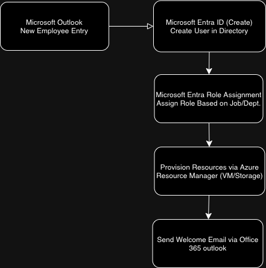

# Logic App Workflow Design and Setup

### Workflow Overview
The Logic App workflow is the core of this project. It automates the process of onboarding new employees, from user creation in Azure AD to sending a welcome email.

### Steps to Implement:
1. **Create a Logic App**: In the Azure portal, create a new Logic App.
2. **Add a Trigger**: Configure the trigger (e.g., SharePoint list entry or email).
3. **Add Actions**:
   - **User Creation**: Use the Azure AD connector to create the new user.
   - **Role Assignment**: Automatically assign roles using job-related conditions.
   - **Resource Provisioning**: Use Azure Resource Manager to provision resources.
   - **Send Welcome Email**: Leverage the Email connector to notify the new hire.

### Example Logic App Workflow:

You can also view the full workflow as a JSON export in [logic-app-workflow.json](./logic-app-workflow.json). 

### Benefits
- **No code required**: Azure Logic Apps is fully configurable through the portal.
- **Flexible triggers**: Workflow can be triggered by various methods, providing flexibility for different hiring processes.
- **Secure and Scalable**: Azure AD governance ensures the system can scale securely as the organization grows.
